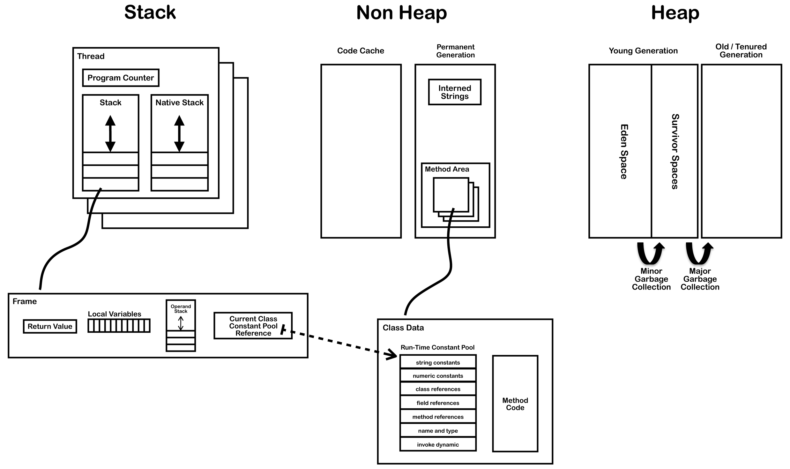

# JVM
> Java 虚拟机规范：https://docs.oracle.com/javase/specs/jvms/se8/html/index.html
> 非常好的一篇文章，以 Java 7 规范为例清楚的描述了 JVM 内部的关键结构：https://blog.jamesdbloom.com/JVMInternals.html

> todo: 使用 go 实现一个 JVM。

## JVM 结构

### 运行时数据区（Run-Time Data Areas）

#### 方法区（Method Area）
Java 虚拟机有一个在所有 Java 虚拟机线程之间**共享**的方法区。
它存储每个类的**结构**，例如**运行时常量池**、**字段**和**方法数据**，以及**方法和构造函数的代码**，包括类和实例初始化以及接口初始化中使用的特殊方法。

##### 运行时常量池（Run-Time Constant Pool）
运行时常量池是每个类或每个接口的 class 文件中 `constant_pool` 表的运行时表示形式。

**每个类或接口都有对应的一个运行时常量池， 它是 class 数据的一部分，每个运行时常量池都是从 Java 虚拟机的方法区分配的**。类或接口的运行时常量池是在 Java 虚拟机创建类或接口时构造的。

运行时常量池介绍相对比较模糊，一般都是一笔带过。看的人往往看完也不知道这到底是个什么东西，有什么用。
简单来说，JVM 维护每个类或接口的常量池，这是一种类似于符号表的运行时数据结构，不过它包含更多数据。一个 class 文件被编译为字节码时，其本身包含的一些数据不直接存储在字节码中，转而存储在方法区的运行时常量池中，并在 class 文件中引用常量池中对应的数据。

有一个非常重要的点是：这里的常量并不是我们编程里面的惯用的常量，比如以 final static 来进行定义的常量。常量池中的常量指的是代码中出现的以下几种类型的数据：
* 数字字面量（numeric literals）
* 字符串字面量（string literals）
* class 引用（class references ）
* 字段引用（field references）
* 方法引用（method references）

观察这些数据可以发现：这些数据是一个 class 文件里固有不变的数据，因为代码中就已经包含了这些数据，所以一个 class 编译后的字节码文件中肯定会包含这些数据。如果将这些数据都放到字节码中，那么可能会太大了，因此将这些数据放在方法区的运行时常量池中。
字节码中需要这些数据的地方会使用符号引用来表示，符号引用是逻辑上的引用，并不指向数据真正的内存位置。这些符号引用会在运行时被 JVM 替换为常量池中真正指向数据内存位置的引用，这个过程也被称为动态链接（Dynamic Linking）。

#### 堆（Heap）
Java 虚拟机有一个在所有 Java 虚拟机线程之间**共享**的堆。堆是运行时数据区域，所有类实例的内存和数组的内存都从这里分配。

#### 程序计数器（PC Register） 
每个 Java 虚拟机线程都有自己**私有**的程序计数器。
在任何时候，每个 Java 虚拟机线程都在执行该线程当前方法的代码，而程序计数器的值则指向当前正在执行的 Java 虚拟机指令的地址

#### Java 虚拟机栈（Java Virtual Machine Stacks）
Java 虚拟机栈用于执行方法。
每个 Java 虚拟机线程都有一个**私有**的 Java 虚拟机栈，与 Java 虚拟机线程同时创建。 Java 虚拟机栈存储栈帧（Frames）。

##### 栈帧（Frame）
对于Java 虚拟机线程的每个方法调用，都会创建一个新栈帧并将其推送到Java 虚拟机栈顶部。当方法正常返回或在方法调用期间抛出未捕获的异常时，栈帧将被弹出。

每个栈帧都包含以下数据：
* 局部变量数组（Local variable array）
* 返回值（Return value）
* 操作数栈（Operand stack ）
* 当前方法所属类的运行时常量池引用（用于动态链接）

#### 本地方法栈（Native Method Stacks）
与 Java 虚拟机栈类似，区别是用来执行本地方法（Native Method）的。通常在创建每个Java 虚拟机线程时为每个Java 虚拟机线程分配本机方法栈。