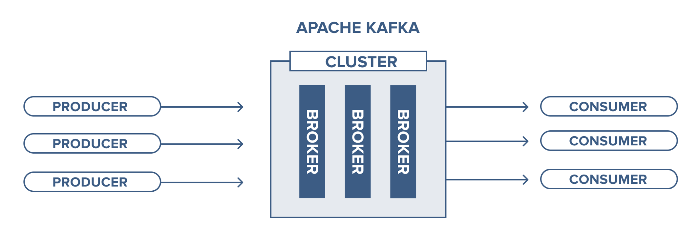
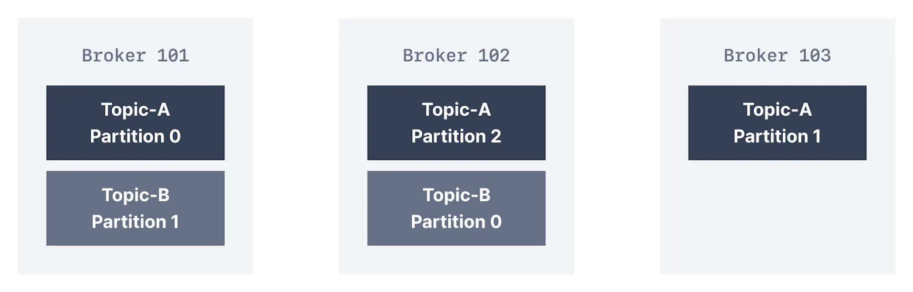
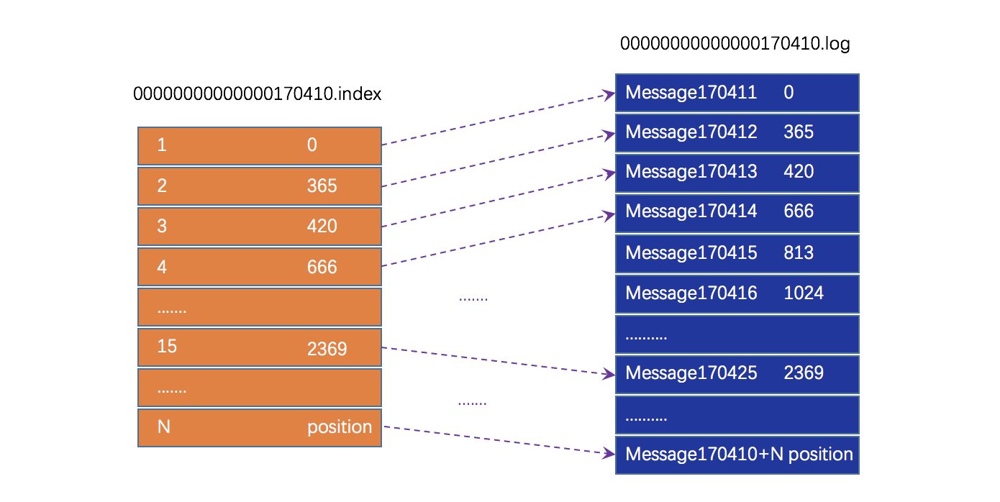
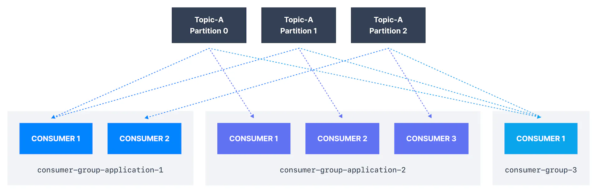

# Kafka 概述
> 官方文档：https://kafka.apache.org/documentation/#gettingStarted
> 以图像的方式清晰的描述 kafka 的主要概念：https://timothystepro.medium.com/visualizing-kafka-20bc384803e7

本文简单描述 Kafka 的架构，数据消费的流程。

## 什么是 Kafka？
Apache Kafka 是一个事件流平台，用于大规模收集、处理、存储和集成数据，它是一种分布式的数据存储，经过内部优化以实时提取和处理流数据。流数据是指由成千上万个数据源持续生成的数据，通常可以同时发送数据。
Kafka 可以支持海量的数据投递和处理，这些数据流入 Kafka 后被持久化，并在需要时被其他服务拉取使用。

在日常使用中，Kafka 常被作为消息队列来使用。为了便于描述，下文将使用消息来指代 kafka 中存储的数据。

## 主要概念

### Producers（生产者）和 Consumer（消费者）
向 Kafka 发送消息的服务被称为 `producer` ，反之，消费 Kafka 中消息的服务被称为`consumer`。
一个 `consumer` 可能也是 `producer`，一个 `producer` 可能也是 `consumer`。

### Topic（主题）
`Topic` 是 Kafka 中消息具体被发送到的地方，`producer` 在发送消息时会指定一个 `topic`，Kafka 会将这个消息存放在指定的 `topic` 下。相应的，`consumer` 需要消费消息时也需要指定一个 `topic`，去拉取这个 `topic`  下的消息。

一个服务可以发送消息到多个 `topic`，也可以消费多个 `topic` 下的消息。

#### Partition（分区）
一个 `topic` 在外界看起来像是一个队列一样，`producer` 向其中添加数据，`consumer` 从队列中拿数据。
事实上 `topic` 并不是一个单独的类似队列的数据结构，而是由一个或多个（通常是多个）`partition` 组成的。一个 `partition` 类似一个队列（但实际不是），每个消息被发送到 `topic` 时会被添加到这个 `topic` 下的其中一个 `partition` 中。将 `topic` 拆分为 `partition` 使得 `topic` 具有很强的可扩展性，同时也会大大提升数据的处理能力（见下文）。

`Partition` 以日志文件的形式存储消息。每当消息发送到 Kafka 中时都会以追加的方式被保存到一个 `partition` 中，一旦写入到 `partition` 中，消息便不可再更改。
分区中的每一条消息都有一个的 `offset`（偏移量），`consumer` 拉取消息时通过指定 `offset` 来按**顺序**消费分区中的消息。通常来说，`consumer`通过不断增加指定的 `offset` 值来顺序消费 `topic` 中的消息，但有时 `consumer` 也可以在消费时选择指定更小或更大的 `offset` 来重复消费一些消息或是跳过消费一些消息。

`Partition` 的数量可以自由指定。如果 Kafka 以集群的方式运行，那么 `partition` 会均衡的分布在集群内部的 `broker` 中。

##### Segment（段）
考虑大数据量的情况下，如果 `partition` 是单一文件，那么文件会变得非常大。因此 Kafka 对 `partition` 进行了切分，一个 `partition` 会由多个 `segment` 组成。当一个 `segment` 超过指定大小时，Kafka 会创建一个新的 `segment` 来写入新的消息。

将 `partition` 细分为 `segment` 后，数据操作的颗粒度更小了。想象一下 `partition` 是大个巨大文件的情况，此时无论是复制数据或是清理数据都不方便进行。

`Segment` 实际上也不是一个单一文件，它由两部分组成：
* **.index*：索引文件。其每一条数据都表示第 N 条消息对应数据文件中的物理偏移地址。
* **.log*：数据文件。消息保存在此文件中，通过索引文件来快速定位每条消息。

> 如果没有索引文件，只能顺序读取文件来定位某条消息，但这速度很慢；或是使用定长存储的方式来计算偏移量，但这会造成大量的空间浪费。

### Consumer Group（消费者组）
多个 `consumer` 可以构成一个消费者组。
以 `producer` 和 `consumer` 的角度去看，一个消费者组就像是一个 `consumer` 一样。消费者组里的 `consumer` 会同时去消费一个 `topic` 里消息，但每条消息只会被其中一个 `consumer` 消费。

消费者组可以使消费者横向扩展来提升处理消息的能力。当消息投递速度大于消费速度时，只需要增加消费者到同一个消费者组中即可增加消费能力来避免消息堆积。在容器化的现在，借由 K8S 这样的编排工具动态扩容以应对业务的突发情况是很常见的情形。

### Broker（代理）
运行 Kafka 的节点（服务器或容器）被称之为 `broker`。 

`Broker`处理来自客户端（`producer` 或 `consumer`）的所有请求（消息上报、消费和请求元数据）并保持数据在集群内复制。

### ZooKeeper
> ZooKeeper 已从 Kafka v4.x 中删除。但 Kafka 属于重要组件，一般体量很大，海量业务都会依赖，切换新版本影响面很大，因此目前很多公司仍是使用旧版本。

ZooKeeper 在旧版本的 Kafka 中是核心依赖组件，ZooKeeper 负责元数据的管理，比如以下内容：`Broker` 注册、`Topic` 注册、`Producer` 和 `Consumer` 负载均衡、维护 `Partition` 与 `Consumer` 的关系、记录消息消费的进度以及 `Consumer` 注册， 以及一切需要分布式一致性的场景。

因为依赖 ZooKeeper，维护 Kafka 的人员也必须了解 ZooKeeper，间接的提高了维护的成本。其次，即使是非常简单的项目，也需要 ZooKeeper 才能启动 Kafka，即使 ZooKeeper 十分轻量，也会增加部署架构上的复杂性。因此在 Kafka 在新版本中移除了 ZooKeeper 的依赖，改用其内部实现的 KRaft 进行元数据管理。

### Kafka Cluster（Kafka 集群）
多个 `broker` 一起工作的集合称为 Kafka 集群。

相对于运行单个 `broker`，Kafka 集群能提供高可用的稳定性：只要集群中可用 `broker` 满足指定数量，Kafka 就能正常提供服务。实际上，大多数生产环境下 Kafka 都是以集群方式运行的。

## 投递与消费
上文提到借由消费者组可以实现多个 `consumer` 不重复的消费同一个 `topic` 中的信息。在消费时，其实是将 `topic` 下的每一个 `partition` 指定给消费者组中的其中一个 `consumer`。

举例来说：
* 假如一个 `topic` 下有三个 `partition`，消费这个 `topic` 的消费者组中一共有三个 `consumer`，那么每个 `consumer` 都会有一个 `partition` 可以消费。

* 假如只有两个 `partition`，但是有三个 `consumer`，那么其中一个 `consumer` 会没有消息可以消费。

* 假如有三个 `partition`，但是由四个 `consumer`，那么其中一个 `consumer` 会额外多消费一个 `partition` 中的消息，也就是说，这个 `consumer` 的负载可能会比其他 `consumer` 更高。

由此也可以看出来，为什么 `topic` 中的消息只会被消费者组中的 `consumer` 消费一次，因为 `partition` 是分配给指定 `consumer` 的，因此组内其他 `consumer` 只能消费到分配给自己的 `partition`。也因此，单个 `partition` 里的消息被消费时是按顺序消费的。

> 在 RabbitMQ 中没有消费者组的概念，消息是由交换器分发到一个队列中，这个队列就像是 `topic`，多个消费者可以同时消费这个队列中的数据。RabbitMQ 会将消息投递给订阅此队列的消费者，一条消息只会给一个消费者，并且会在确认消息投递后删除消息。

### 消息有序性
上文解释了为什么单个 `partition` 里的消息消费时是有序的，那么其实也可以得出包含多个 `partition` 的 `topic` 在消费时无法保证顺序的。
每个 `consumer` 的消费速率不同，当消息以顺序被投递到 `topic` 时，可能被分散到多个 `partition` 中，你无法保证先投递的消息会被先消费。
就算只有单个 `consumer`，如果是多个 `partition` 的情况，`consumer` 拉取消息也可能是多个 `partition` 同时拉取一部分消息然后一起消费，仍然无法保证消息的消费顺序。