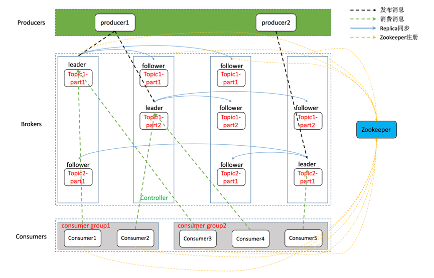
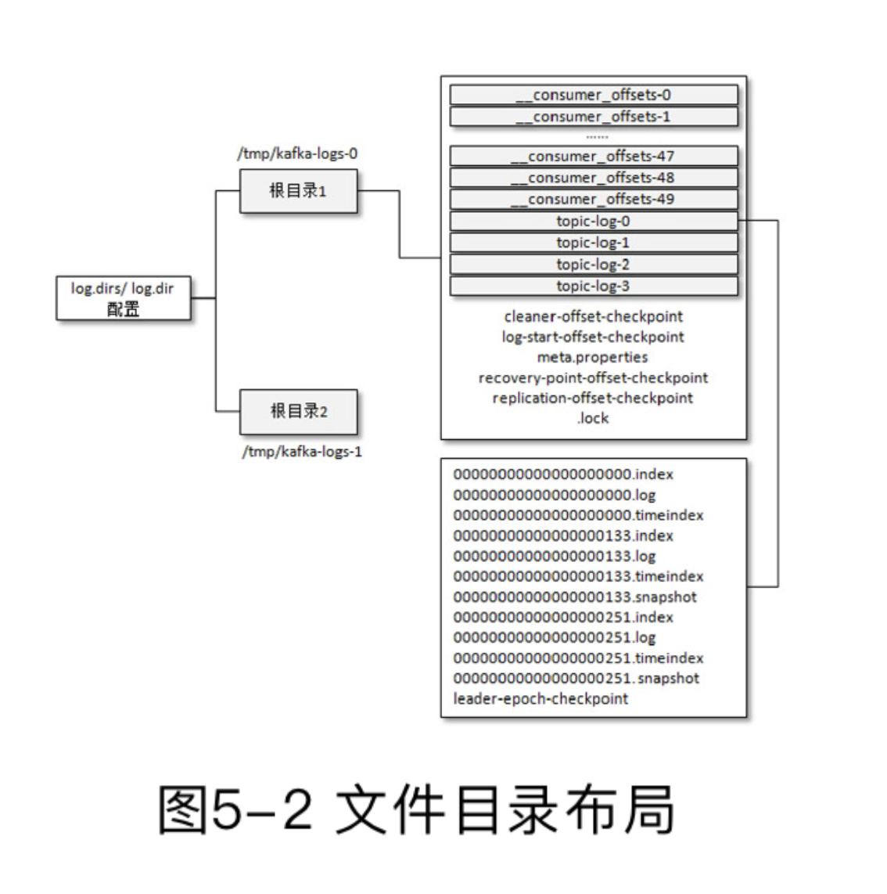

# Topic 与 Partition
> 参考：
> https://kafka.apache.org/documentation/#replication
> https://timothystepro.medium.com/visualizing-kafka-20bc384803e7
> https://www.conduktor.io/kafka/kafka-topics-internals-segments-and-indexes/
> https://www.cloudkarafka.com/blog/apache-kafka-replication-factor-perfect-number.html

> 部分内容是基于 Java 客户端代码得出的，其他语言可能不同。
> Kafka 生产环境下绝大部分是集群部署，因此以下内容默认都是集群模式下的情况。

本文深入探讨（其实不深入） Kafka 核心概念 Topic 与 Partition 的内部原理。

## Topic
Kafka 是一个事件流平台，消息（事件）流向 Kafka，随后通过 Kafka 又流向其他服务或平台。

对于海量的消息而言，需要有一个划分或组合它们的概念，在 Kafka 中被称为 `topic`。`Topic` 用于描述一类在某种程度上具有联系的数据，这些数据可能具有某些相同特征，比如来源相同或是业务类型相同等等。这类似数据库中的表的概念，将这些数据划分在一起。
在实际业务中，对于开发者而言，`topic` 是最直接接触的概念，我们需要确定需要消费哪个 `topic` 里的消息，或是向哪个 `topic` 中投递消息，这往往取决于业务逻辑需要怎么做。

消息以日志的方式存放在 `topic` 中。Kafka 中将消息保存在日志文件中，并且以追加的方式不断写入文件。这表明消息一旦写入便不可更改，同时消费端将通过偏移量来顺序消费日志中的消息。简单的存储结构和读取方式让 Kafka 的吞吐量得以提高，同时也会在数据复制和同步上降低复杂性。

由于使用文件进行存储，消息被成功写入 `topic` 时，它就完全的持久化到硬盘空间上了。Kafka 会保存这些消息，即使消息已经被消费过了。直到日志文件超过了一定大小，或是日志文件的存在超过了指定时间，Kafka 会自动进行清理。清理工作是滚动进行的，即每次都会先删除最旧的数据。

## Partition
实际上，在 Kafka 中，基本的存储单元不是 `topic`，而是 `partition`（分区）。`Topic` 是一个抽象概念，用于划分数据。实际数据写入的地方是该 `topic` 下的某个 `partition`。

每一个 `topic` 都被分为一个或多个 `partition`。每个 `partition` 都可以同时承载消息的读取和写入，这允许多个消费者并行消费单个 `topic`，使得业务能够更加简单的进行横向扩展。

### Replication
高可用是所有重要中间件的通用要求，Kafka 以集群部署的形式来实现高可用，一个集群中可以包含多个 `broker`。
想象一下假设集群中某个节点故障，那么该节点下的 `topic` 该如何不受影响的正常写入和读取呢？一个很朴素但非常有用的解决方法是在其他节点上保留 `topic` 的副本，在当前节点异常时通过其他节点上的副本来恢复工作，这种备份的方式也被称作 *冗余复制*。实际上，大多数的高可用方法都是基于这一简单的想法，只是实现方式有所不同。Kafka 也不例外，在 Kafka 中通过 `replica`（副本）的设计来避免节点故障带来的数据丢失。

首先，`topic` 被分为多个 `partition`，`partition` 的数量可以通过配置 `num.partitions` 指定。一旦确定好 `partition` 的数量后，Kafka 会负责将所有 `partition` 尽可能均匀的分布到集群中的各个节点下。通过这样的分布后，每个节点下的 `partition` 都能同时进行读取和写入，因此单个 `topic` 是可用并行处理的，这大大提高了 Kafka 的吞吐能力。同时也能进行负载均衡，将 `topic` 的请求尽可能均匀的分散到所有节点上。

上述分布在各个节点下的 `partition` 被称作 `leader`（领导者）副本，该 `partition` 的所有读取和写入请求都将会交给 `leader` 副本所在的 `broker` 负责。
现在我们已经将单个 `topic` 的若干个分区分散到各个节点下了。但别忘记，为了在某些节点故障后仍能正常工作，我们还需要保留一些备份到其他节点上，否则一旦节点异常，节点下分布的 `partition` 就会无法写入或丢失。因此，现在需要再将分布到这些节点下的 `partition` 复制到其他节点下，这些副本被称为 `follower`（追随者） 副本。

`Partition` 副本的数量可由配置 `replication.factor` 进行指定，注意，`replication.factor` 指定的数量已经包含了 `leader` 副本。我们这里以 `replication.factor=1` 为例子，这表示每个 `partition` 在集群中只会存在一个 `leader` 副本，没有 `follower` 副本。如果 `replication.factor=3`，那么除了一个 `leader` 副本外，在另外两个 broker 中，还会保留该 `partition` 的 `follower` 副本。Kafka 会将副本不重复的分布在各个节点下，也就是说同一个 `partition` 在一个 `broker` 上最多只会有一个副本。
> 注意：`replication.factor` 的值不能大于可用 `broker` 的数量。

如下图所示，下图展示了集群中包含三个节点下时 `replication.factor=2` 的情况。不同颜色代表不同的 `topic`，#1，#2 代表 `topic` 被分为两个分区。

当投递一条消息到 `broker` 时，生产者必须同时指定 `topic` 和 `partition` 来表明消息最终写入的地方，`broker` 只负责写入消息而不会帮生产者去选择合适的写入 `partition`。
`Partition` 冗余分布在集群中各个 `broker` 中，生产者只会将消息发送到每个 `partition` 的 `Leader` 副本所在的 `broker` 中，写入 `Leader` 副本后由 `broker` 通过复制的方式同步给其他副本。
`Follower` 副本并不负责生产者或消费者请求的处理，它只会同步来自 `Leader` 副本的数据。每个 `partition` 的请求都只会交由 `Leader` 副本所在的 `broker` 来进行处理，一旦数据写入 `Leader` 副本所在 `broker`，`broker` 会将数据同步给 `Follower` 副本。
由上述操作流程可知，每个生产者在发送消息前都需要获取到集群内部 `topic`、`partition` 的相关信息。因此，发送消息前，生产者都会先向 `broker` 获取一系列元数据，这些元数据可以用于帮助生产者来确定发送到哪个 `broker`（`Leader` 副本所在的节点），以及在未指定 `partition`  时通过可用的 `partition` 列表来默认指定 `partition`。

##### Partitioner (分区器)
> 以下内容针对于 Java 语言的 Kafka 客户端代码。 

在使用 Kafka 客户端代码进行消息发送时，`partition` 和 消息 `key` 是可选的。如果指定了 `partition`，Kafka 会将消息写入到指定的 `partition` 中。

如果没有指定 `partition`，Kafka 将使用分区器来计算需要该消息需要投放到的 `partition`.

 ~~默认的分区器实现会使用 `key` 的 `hash` 值来进行 `partition` 的选择，这意味着拥有相同的不为空的 `key` 的消息最终会被写入到相同的 `partition` 中。
如果 `key` 为空，会计算出一个投递的 `partition`，并且后续所有 `key` 为空的消息都会被投递至这一 `partition`。因此，正常情况下，如果没有指定 `partition`，你不应该传递空  `key`。~~

不同 Kafka 的版本默认分区器及其处理方式有所不同:
* 2.3及其以下版本的 Kafka 默认的分区器是 `DefaultPartitioner`, 该分区器在指定 `key` 的情况下使用 `key` 的 `hash` 值来计算出 `partition` 作为消息投放的目的地. 这意味者相同 `key` 的消息会被投放到同一个 `partition` 中. 如果没有指定 `key`, 将以循环方式为消息选择分区. 其具体实现是使用一个 `AtomicInteger`, 用这个值自增, 然后对可用分区数进行取模得到 `partition` 的值. 每条消息将均匀的分配到各个可用分区上.
  但为每条记录选择不同的分区可能会降低分区批次消息的大小, 这使得消息处理的延迟上升.
* 为了解决上述问题, 2.4 及以上版本的 Kafka 引入了称为**粘性分区**的策略, 并将其作为默认分区策略. 简单来说, 不再为每个未指定 `key` 的消息单独选择分区, 而是选择单个分区来发送所有未指定 `key` 的消息, 这使得这些消息会处于同一批次进行发送, 发送该批次消息后, 再随机选择一个新的分区作为下一批未指定 `key` 消息的分区. 这样的策略解决了将没有指定 `key` 时, 消息分散成较小批次的问题。
  > https://cwiki.apache.org/confluence/display/KAFKA/KIP-480%3A+Sticky+Partitioner
  >https://www.confluent.io/blog/apache-kafka-producer-improvements-sticky-partitioner/
* 上述的粘性分区策略在一定情况下可能会造成某些分区负载变得更大. 考虑当某分区处理消息速度落后其他分区时, 由于较慢分区处理速度更慢, 发送给该分区的批次相对于其他分区有更大的可能会完全填满消息甚至堆积多个批次, 这意味着将会有更多的消息被写入该分区, 这又会增加本就较慢分区的压力, 形成恶性循环.
  因此, 在 Kafka 3.0 版本以后, 执行粘性分区策略时, 将根据指定的大小来进行切换分区, 而不是等待批次填充满或是超过指定时间. 当批次累加到一定大小时, 将切换到下一个可用分区, 并开始新一个批次的填充.
  > https://cwiki.apache.org/confluence/display/KAFKA/KIP-794%3A+Strictly+Uniform+Sticky+Partitioner

上述默认实现也许不能满足使用，另一种常见的情况是自己自定义 `Partitioner` 来自定义不指定 `partition` 时如何计算出写入的 `partition`。

##### ISR
前文提到 Kafka 支持集群模式进行部署以实现高可用，在分布式系统中，集群部署非常常见的一个确保高可用的方式是多数投票：只要超过半数节点正常，整个集群便可正常提供服务。

但 Kafka 在保证可用性的设计上并不是使用多数投票来实现。在理解 Kafka 如何实现高可用之前，需要先了解一些概念。
Kafka 在内部维护了一组同步副本（in-sync replicas），被称为 `ISR`。`ISR` 需要满足两点：
* `broker` 必须与 `controller` 保持活动会话，以便接收定期元数据更新。
* `follower` 副本必须复制 `leader` 副本的写入，并且不能落后 `leader` 副本太多。

注意 `ISR` 中包含 `leader` 副本。

每个 `partition` 都存在对应的 `ISR` 列表，且会动态变化。在正常情况下，`ISR` 就是 `partition` `leader` 和 `follower` 所在的所有节点。

Kafka 可以通过 `ISR` 来确定数据的写入是否正常。在常见的分布式集群下，成功写入的标准一般是写入集群内超过半数的节点。而在 Kafka 中，数据写入的地方是 `partition`，对于某个 `partition`，集群中某些节点上可能并不存在这个 `partition` 的副本。这就意味着对于写入数据而言，只需要关心 `partition` 副本（`leader` / `follower`）所在的 `broker` 即可。`ISR`  列表是动态变化的，一旦 `broker` 落后太多数据或是故障，就会被移出 `ISR`。在此基础上，Kafka 通过 `ISR` 确定某个 `partition` 对应的一组处于 *“同步”* 状态的节点，并以此来衡量写入是否成功。

具体来说，在投递数据时，生产者有一个配置：`acks` 非常重要，它指定了发送到 `partition` 中的消息被认定为成功写入的标准。有三个取值：0，1，-1（与 all 是等价的）。分别代表生产者发送数据后就代表成功写入；生产者发送数据后，需等待写入 `leader` 副本后返回 `broker` 的确认才算成功写入。
第三个取值单独解释，当 `acks` 设置为 all 时，生产者发送数据后，除了需要写入 `leader` 副本，还需要等待数据同步到其他 `ISR` 上。由于 `ISR` 会动态变化，假设现在集群中某个 `partition` 分布在 20 个 `broker` 上，但有 18 个 `broker` 都已经故障或是数据落后 `leader` 过多，此时 `ISR` 的数量为 2，这时集群明显出现了问题，即使数据写入到剩余的 `ISR` 副本中, 由于可用节点较少，数据丢失的风险仍然较高。因此我们希望在 `ISR` 数量较少的情况下能够拒绝数据再继续写入以免出现数据丢失。
因此在 `acks` 为 all 时，需要指定数据正常写入所需的 `ISR` 的最小数量。配置：`min.insync.replicas` 的作用就是这样，该配置指定了必须确认写入的最小 `ISR` 数。该配置只在 `acks` 为 all 时生效，因为其余两个选项并不会要求确认 `ISR` 写入的结果。
`min.insync.replicas` 默认值为 1，代表 `ISR` 副本的数量至少要为 1，否则抛出 `NotEnoughReplicasException`。而 `leader` 副本也是 `ISR` 中的一员。因此在使用默认值时，`acks` 配置为 1 和 all 是等效的。假设数据尝试写入时 `ISR` 数少于配置值，比如配置值为 3，但 `ISR` 数量为 2，那么会拒绝写入数据。如果写入 `leader` 后成功同步的其他 `ISR` 数量小于配置的值，即没有足够多的  `ISR` 成功写入了数据。那么会抛出 `NotEnoughReplicasAfterAppend`。
`ISR` 的数量必定会小于或等于可用的 `broker` 数量, 因此 `min.insync.replicas` 的值也必须小于或等于可用的 `broker` 数量。

### Segment
我们已经知道了 `topic` 由 `partition` 组成，数据写入时需要指定写入的 `topic` 和 `partition`。实际上，`partition` 并不是数据存储的最小单位，一个 `partition` 还会被分为多个 `segment`（段）。`Segment` 的作用是将一个 `partition` 进行拆分，从而避免单个日志文件过大。另一方面来说，拆分过后，Kafka 对于 `partition` 的操作颗粒度可以更加精细，比如删除过期数据时，Kafka 可以直接将一整个 `segment` 直接删除，而不是读取一整个大文件，然后找到过期数据进行清理。

Kafka 日志目录结构如下图所示：

与 segment 有关的部分文件的作用分别是：

这些是与消息记录相关的文件：
* .log 文件存储具体的消息记录
* .index 文件存储消息偏移量（offset）到消息物理地址之间的映射关系
* .timeindex 文件存储消息时间戳（timestamp）到消息偏移量（offset）之间的映射关系
> 很明显，.index，.timeindex 都是为了加快在 .log 文件中查找具体消息的速度。

这些是与集群或复制副本相关的文件：
* .snapshot 文件用于存储选择新 `leader` 时所需的生产者状态信息
* leader-epoch-checkpoint 文件存储了之前所有领导人的详细信息

segment 的大小由以下参数进行指定：
* `log.segment.bytes` 参数指定单个 `segment` 的大小，默认为 1 GB。
* `log.roll.ms` 或 `log.roll.hours` 参数指定单个 `segment` 的可持续写入的时间，默认值为 1 周。

如果超过上面任意一个配置的参数，该 `segment` 将关闭并打开一个新的 `segment`。

segment 的保留时间由以下参数进行指定：
* `log.retention.ms` 或 `log.retention.minutes` 或 `log.retention.hours` 参数指定 `segment` 的保留时间，默认值为 1 周。
* * `log.retention.bytes` 参数指定每个 `partition` 最多保留多大的日志文件，默认值为 -1，表示不做限制。

如果超过上面任意一个配置的参数，Kafka 都将清理部分日志来确保符合配置。清理日志是以删除 `segment` 文件来进行的，而不是清除单个 `segment` 文件的部分内容。

了解完 `topic`，`partition`，`segment` 的关系后，也许你会想，为什么还要再拆分 `partition` 为 `segment` 来存储数据，而不是直接以 `partition` 来存储数据，通过划分更多的 `partition` 来减少单个 `partition` 文件的大小。

