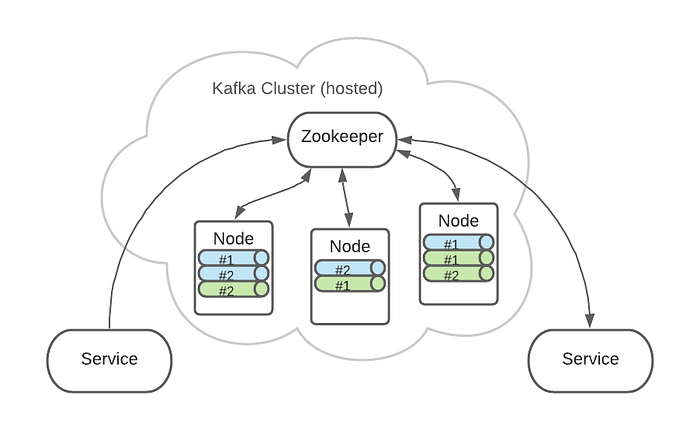

# Topic 与 Partition
> 部分内容是基于 Java 客户端代码得出的，其他语言可能不同。
> Kafka 生产环境下绝大部分是集群部署，因此以下内容默认都是集群模式下的情况。

本文深入探讨（其实不深入） Kafka 核心概念 Topic 与 Partition 的内部原理。

## Topic
Kafka 是一个事件流平台，消息（事件）流向 Kafka，随后通过 Kafka 又流向其他服务或平台。

对于海量的消息而言，需要有一个划分或组合它们的概念，在 Kafka 中被称为 `topic`。`Topic` 用于描述一类在某种程度上具有联系的数据，这些数据可能具有某些相同特征，比如来源相同或是业务类型相同等等。这类似数据库中的表的概念，将这些数据划分在一起。
在实际业务中，对于开发者而言，`topic` 是最直接接触的概念，我们需要确定需要消费哪个 `topic` 里的消息，或是向哪个 `topic` 中投递消息，这往往取决于业务逻辑需要怎么做。

消息以日志的方式存放在 `topic` 中。Kafka 中将消息保存在日志文件中，并且以追加的方式不断写入文件。这表明消息一旦写入便不可更改，同时消费端将通过偏移量来顺序消费日志中的消息。简单的存储结构和读取方式让 Kafka 的吞吐量得以提高，同时也会在数据复制和同步上降低复杂性。

由于使用文件进行存储，消息被成功写入 `topic` 时，它就完全的持久化到硬盘空间上了。Kafka 会保存这些消息，即使消息已经被消费过了。直到日志文件超过了一定大小，或是日志文件的存在超过了指定时间，Kafka 会自动进行清理。清理工作是滚动进行的，即每次都会先删除最旧的数据。

## Partition
实际上，在 Kafka 中，基本的存储单元不是 `topic`，而是 `partition`（分区）。`Topic` 是一个抽象概念，用于划分数据。实际数据写入的地方是该 `topic` 下的某个 `partition`。

每一个 `topic` 都被分为一个或多个 `partition`。每个 `partition` 都可以同时承载消息的读取和写入，这允许多个消费者并行消费单个 `topic`，使得业务能够更加简单的进行横向扩展。

### Replica
高可用是所有重要中间件的通用要求，Kafka 以集群部署的形式来实现高可用，只要超过半数节点可用，Kafka 集群便可正常提供服务。
想象一下假设集群中某个节点故障，那么该节点下的 `topic` 该如何不受影响的正常写入和读取呢？一个很朴素但非常有用的解决方法是在其他节点上保留 `topic` 的副本，在当前节点异常时通过其他节点上的副本来恢复工作。实际上，大多数的高可用方法都是基于这一简单的想法，只是实现方式有所不同。Kafka 也不例外，在 Kafka 中通过 `replica`（副本）的设计来避免节点故障带来的数据丢失。

首先，`topic` 被分为多个 `partition`，`partition` 的数量可以通过配置 `num.partitions` 指定。一旦确定好 `partition` 的数量后，Kafka 会负责将所有 `partition` 尽可能均匀的分布到集群中的各个节点下。通过这样的分布后，每个节点下的 `partition` 都能同时进行读取和写入，因此单个 `topic` 是并行处理的，大大提高了 Kafka 的吞吐能力。同时也能进行负载均衡，将 `topic` 的请求尽可能均匀的分散到所有节点上。
上述分布在各个节点下的 `partition` 被称作 `leader`（领导者）副本，该 `partition` 的所有读取和写入请求都将会交给 `leader` 副本所在的 `broker` 负责。
现在我们已经将单个 `topic` 的若干个分区分散到各个节点下了。但别忘记，为了在某些节点故障后仍能正常工作，我们还需要保留一些备份到其他节点上，否则一旦节点异常，节点下分布的 `partition` 就会无法写入或丢失。因此，现在需要再将分布到这些节点下的 `partition` 复制到其他节点下，这些副本被称为 `follower`（追随者） 副本。
`Partition` 副本的数量可由配置 `replication.factor` 进行指定，注意，副本的数量包含 `leader` 副本。我们这里以 `replication.factor=1` 为例子，这表示每个 `partition` 在集群中只会存在一个 `leader` 副本，没有 `follower` 副本。如果 `replication.factor=3`，那么除了一个 `leader` 副本外，在另外两个 broker 中，还会保留该 `partition` 的 `follower` 副本。Kafka 会将副本不重复的分布在各个节点下，也就是说同一个 `partition` 在一个 `broker` 上最多只会有一个副本。
> 注意：`replication.factor` 的值不能大于可用 `broker` 的数量。

如下图所示，下图展示了集群中包含三个节点下时 `replication.factor=2` 的情况。不同颜色代表不同的 `topic`，#1，#2 代表 `topic` 被分为两个分区。

`Follower` 副本并不负责生产者或消费者请求的处理，它只会同步 `leader` 副本的数据。每个 `partition` 的请求都只会交由 `follower` 副本所在的 `broker` 来进行处理，一旦数据写入 `leader` 副本所在 `broker`，`broker` 会将数据同步给 `follower` 副本。
> 在使用 Kafka 投递消息时，有一个参数 `acks` 非常重要，它指定了发送到 `partition` 中的消息被认定为成功写入的标准。有三个取值：0，1，-1/all。分别代表生产者发送后就代表成功写入；生产者发送后，写入 `leader` 副本后就算成功写入；生产者发送后，写入 `leader` 副本后，还必须同步到所有的 `follower` 副本成功后才算写入成功。

当投递一条消息到 `broker` 时，生产者必须同时指定 `topic` 和 `partition` 来表明消息最终写入的地方，`broker` 只负责写入消息而不会帮生产者去选择合适的写入 `partition`。
`Partition` 冗余分布在集群中各个 `broker` 中，生产者只会将消息发送到每个 `partition` 的 `Leader` 副本所在的 `broker` 中，写入 `Leader` 副本后由 `broker` 通过复制的方式同步给其他副本。
由上述操作流程可知，每个生产者在发送消息前都需要获取到集群内部 `topic`、`partition` 的相关信息。因此，发送消息前，生产者都会先向 `broker` 获取一系列元数据，这些元数据可以用于帮助生产者来确定发送到哪个 `broker`（`Leader` 副本所在的节点），以及在未指定 `partition`  时通过可用的 `partition` 列表来默认指定 `partition`。

> 以下内容针对于 Java 语言的 Kafka 客户端代码。 
> 
>在使用 Kafka 客户端代码进行消息发送时，`partition` 和 消息 `key` 是可选的。如果指定了 `partition`，Kafka 会将消息写入到指定的 `partition` 中。
>
> 如果没有指定 `partition`，默认的实现会使用 `key` 的 `hash` 值来进行 `partition` 的选择，这意味着拥有相同的不为空的 `key` 的消息最终会被写入到相同的 `partition` 中。
> 如果 `key` 为空，会计算出一个投递的 `partition`，并且后续所有 `key` 为空的消息都会被投递至这一 `partition`。因此，正常情况下，如果没有指定 `partition`，你不应该传递空  `key`。
> 
> 上述默认实现也许不能满足使用，另一种常见的情况是自己自定义 `Partitioner` 来自定义不指定 `partition` 时如何计算出写入的 `partition`。

